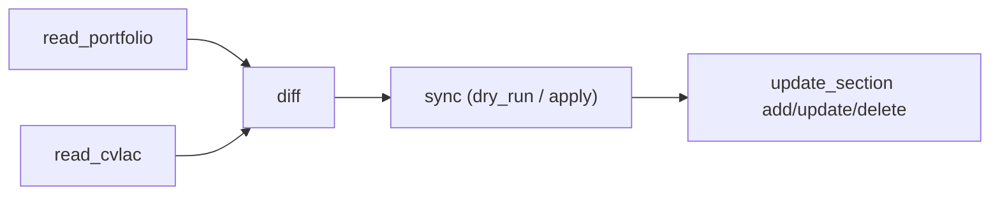

# cvlac-mcp


Servidor MCP (stdio) para sincronizar el perfil de **CvLAC** con un portafolio canónico (por defecto `https://stivenson.github.io`) usando **TypeScript + Playwright**.

Permite:
- leer datos en vivo del CvLAC (`read_cvlac`)
- leer el portafolio (`read_portfolio`)
- calcular diferencias (`diff`)
- aplicar cambios por sección (`update_section`: `add` / `update` / `delete`)
- sincronizar de forma masiva (`sync`, con `dry_run`)

---

## Tabla de contenido

- [Arquitectura](#arquitectura)
- [Tools MCP disponibles](#tools-mcp-disponibles)
- [Requisitos](#requisitos)
- [Instalación](#instalación)
- [Variables de entorno](#variables-de-entorno)
- [Uso local](#uso-local)
- [Integración con Cursor MCP](#integración-con-cursor-mcp)
- [Flujo recomendado](#flujo-recomendado)
- [Pruebas y build](#pruebas-y-build)
- [Troubleshooting](#troubleshooting)
- [Seguridad y buenas prácticas](#seguridad-y-buenas-prácticas)

---

## Arquitectura

```text
src/
├── index.ts                  # Entry point (dotenv + stdio transport)
├── server.ts                 # Registro de tools MCP
├── types.ts                  # Tipos de portfolio/CvLAC/diff/update
├── diff.ts                   # Motor de comparación (normalize + nameMatches)
├── browser/
│   ├── session.ts            # Login, sesión persistente, Playwright context
│   └── navigation.ts         # URLs de listas y formularios CvLAC
├── tools/
│   ├── login.ts
│   ├── read-cvlac.ts
│   ├── read-portfolio.ts
│   ├── diff.ts
│   ├── update-section.ts     # add/update/delete por sección
│   ├── sync.ts
│   └── screenshot.ts
└── extractors/
    ├── portfolio.ts
    └── cvlac/
        formacion.ts experiencia.ts cursos.ts reconocimientos.ts
        proyectos.ts software.ts eventos.ts
```

---

## Tools MCP disponibles

- `login`: autentica en CvLAC y persiste sesión.
- `read_cvlac`: lee una sección o todas (`all`) desde CvLAC.
- `read_portfolio`: obtiene y parsea el portafolio.
- `diff`: compara CvLAC vs portafolio y reporta `missing` / `upToDate`.
- `update_section`: aplica cambio puntual (`add`, `update`, `delete`).
- `sync`: ejecuta diff + aplica faltantes (con `dry_run` opcional).
- `screenshot`: captura pantalla del estado actual.
- `inspect_form`: inspecciona campos reales (`input/select/textarea`) de una URL CvLAC.

Secciones soportadas:
`formacion`, `experiencia`, `cursos`, `reconocimientos`, `proyectos`, `software`, `eventos`.

---

## Requisitos

- Node.js 20+
- npm 10+
- Acceso a credenciales CvLAC válidas
- Entorno Linux/macOS recomendado para Playwright

---

## Instalación

```bash
npm install
```

---

## Variables de entorno

Crea `.env` (puedes copiar de `.env.example`):

```bash
CVLAC_NOMBRE=TuNombre
CVLAC_CEDULA=TuDocumento
CVLAC_PASSWORD=TuPassword
CVLAC_SESSION_PATH=/home/TU_USUARIO/.cvlac-session.json
PORTFOLIO_URL=https://stivenson.github.io
```

Notas:
- `CVLAC_SESSION_PATH` guarda `storageState` para reusar sesión.
- `PORTFOLIO_URL` permite apuntar a otro portafolio si lo necesitas.

---

## Uso local

### Modo desarrollo (sin compilar)

```bash
npm run dev
```

### Modo producción local (compilado)

```bash
npm run build
npm start
```

---

## Integración con Cursor MCP

Este servidor se ejecuta vía `stdio` y el entrypoint real es `dist/index.js`.

Ejemplo de configuración (referencial):

```json
{
  "mcpServers": {
    "cvlac-mcp": {
      "command": "node",
      "args": ["/ruta/a/cvlac-mcp/dist/index.js"],
      "env": {
        "CVLAC_NOMBRE": "TuNombre",
        "CVLAC_CEDULA": "TuDocumento",
        "CVLAC_PASSWORD": "TuPassword",
        "CVLAC_SESSION_PATH": "/home/TU_USUARIO/.cvlac-session.json",
        "PORTFOLIO_URL": "https://stivenson.github.io"
      }
    }
  }
}
```

---

## Flujo recomendado

1. `login`
2. `read_portfolio`
3. `read_cvlac`
4. `diff`
5. `sync` con `dry_run: true`
6. Si el reporte es correcto, `sync` sin `dry_run` o `update_section` por ítem

### Diagrama



---

## Pruebas y build

```bash
npm test
npm run build
```

Comandos disponibles:

```bash
npm run dev
npm run test:watch
npm start
```

---

## Troubleshooting

### `gh`/MCP usa versión vieja

- Asegúrate de ejecutar `npm run build`.
- El cliente MCP ejecuta `dist/index.js`, no `src/index.ts`.

### Redirección inesperada a login

- La sesión pudo expirar.
- Ejecuta `login` nuevamente.
- Verifica que `.env` tenga credenciales correctas.

### Cambios no aplican en formularios

- Algunos campos de CvLAC son `readonly` y se setean por JS.
- Usa `inspect_form` y `screenshot` para validar nombres de campo reales.
- Revisa `docs/cvlac-findings.md` como fuente de verdad.

### Falsos faltantes en `diff`

- `nameMatches()` normaliza acentos y sufijos (ej. `(Platzi)`, ` - Aprobado ...`).
- `experiencia` está intencionalmente fuera del diff automático.

---

## Seguridad y buenas prácticas

- No hardcodear credenciales.
- No commitear `.env` ni archivos de sesión/screenshot.
- Correr primero `sync` en `dry_run`.
- Para pruebas de escritura real en CvLAC, usar ítems dummy y luego eliminar.

---

## Estado del proyecto

- Lectura de las 7 secciones verificada contra navegación real.
- `update_section` soporta `add` / `update` / `delete`.
- `dist/` debe regenerarse tras cambios en `src/`.

Para detalles operativos de desarrollo interno, ver `CLAUDE.md`.
