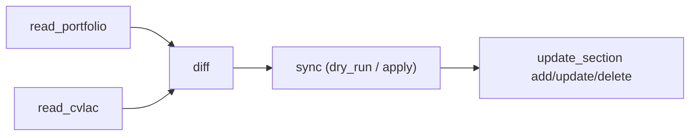

<p align="center">
  <picture>
    <source media="(prefers-color-scheme: dark)" srcset="assets/logo-dark.svg">
    
  </picture>
</p>

<h1 align="center">cvlac-mcp</h1>


Servidor MCP (stdio) para sincronizar tu perfil de **CvLAC** (MinCiencias) con tu portafolio web, usando **TypeScript + Playwright**.

No trae datos de nadie: tus credenciales, tus valores por defecto y tus proyectos curados viven en archivos locales que el repo ignora. Sirve para cualquier persona con una hoja de vida en CvLAC.

Permite:
- leer datos en vivo del CvLAC (`read_cvlac`, `read_cvlac_detail`)
- leer el portafolio (`read_portfolio`)
- calcular diferencias (`diff`): faltantes, a actualizar, parecidos y al día
- aplicar cambios por sección (`update_section`: `add` / `update` / `delete`)
- sincronizar de forma masiva (`sync`, con `dry_run`)

Dos garantías al escribir: **nunca crea un duplicado sin preguntar** (si ya hay algo igual o parecido devuelve `needs_confirmation` en vez de escribir) y **siempre dice qué campo falló** cuando CvLAC rechaza un formulario.

> **Uso responsable.** Esto automatiza un sitio gubernamental con tu propia cuenta. Úsalo con supervisión humana, revisa cada `dry_run` antes de aplicar y no lo dejes corriendo sin mirar.

> **Proyecto independiente.** No está afiliado a MinCiencias ni respaldado por esa entidad. No
> reproduce su logotipo ni su identidad visual: el símbolo de arriba es original —unas llaves
> `{ }` de JSON-RPC dentro de un anillo de trazos que convergen— y las marcas «CvLAC», «ScienTI»
> y «MinCiencias» se nombran solo para identificar el sistema con el que habla el servidor.

Qué está verificado, qué falta y las limitaciones conocidas: **[ROADMAP.md](ROADMAP.md)**.

---

## Tabla de contenido

- [Inicio rápido: instalar y configurar el MCP (Linux, Windows, macOS)](#inicio-rápido-instalar-y-configurar-el-mcp-linux-windows-macos)
  - [Registrar el MCP en tu editor](#paso-5---registrar-el-mcp-en-tu-editor) — Cursor · Claude Code · Claude Desktop · VS Code · Windsurf · Zed · JetBrains
  - [Alternativa: instalar desde npm](#paso-5b---alternativa-instalar-desde-npm-sin-clonar)
- [Arquitectura](#arquitectura)
- [Tools MCP disponibles](#tools-mcp-disponibles)
- [Variables de entorno](#variables-de-entorno)
- [Uso local](#uso-local)
- [Flujo recomendado](#flujo-recomendado)
- [Pruebas y build](#pruebas-y-build)
- [Troubleshooting](#troubleshooting)
- [Seguridad y buenas prácticas](#seguridad-y-buenas-prácticas)
- [Estado y roadmap](#estado-y-roadmap)

---

## Inicio rápido: instalar y configurar el MCP (Linux, Windows, macOS)

Esta es la guía oficial de instalación y configuración. Sigue los pasos en orden; cada uno incluye una verificación para no avanzar con un entorno roto.

### Paso 0 - Prerrequisitos (todas las plataformas)

Necesitas **Node.js 20 o superior**, **npm 10+** y **git**.

| Plataforma | Cómo instalar Node 20+ |
|---|---|
| **Linux** (Debian/Ubuntu) | `curl -fsSL https://deb.nodesource.com/setup_20.x \| sudo -E bash - && sudo apt-get install -y nodejs git` |
| **Linux** (cualquier distro, recomendado) | Instalar [nvm](https://github.com/nvm-sh/nvm) y luego `nvm install 20 && nvm use 20` |
| **macOS** | `brew install node@20 git` (con [Homebrew](https://brew.sh)) o nvm |
| **Windows** | `winget install OpenJS.NodeJS.LTS` y `winget install Git.Git` (o instalador desde [nodejs.org](https://nodejs.org)) |

**Verifica** (sirve igual en bash, zsh o PowerShell):

```bash
node --version   # debe mostrar v20.x o superior
npm --version    # debe mostrar 10.x o superior
git --version
```

### Paso 1 - Clonar el repositorio

**Linux / macOS (bash o zsh):**

```bash
cd ~/dev            # o la carpeta que prefieras
git clone https://github.com/stivenson/cvlac-mcp.git
cd cvlac-mcp
```

**Windows (PowerShell):**

```powershell
cd $HOME\dev        # crea la carpeta antes si no existe: mkdir $HOME\dev
git clone https://github.com/stivenson/cvlac-mcp.git
cd cvlac-mcp
```

### Paso 2 - Instalar dependencias y compilar

Igual en las tres plataformas:

```bash
npm install
npm run build
```

**Verifica:** debe existir el archivo de entrada compilado `dist/index.js`.

```bash
# Linux / macOS
ls dist/index.js
```

```powershell
# Windows (PowerShell)
Test-Path dist\index.js   # debe imprimir True
```

### Paso 3 - Instalar el navegador de Playwright

El servidor automatiza CvLAC con Chromium headless. Descárgalo explícitamente (robusto en cualquier SO):

```bash
npx playwright install chromium
```

En **Linux**, si faltan librerías del sistema, instala también las dependencias nativas:

```bash
npx playwright install-deps chromium   # requiere sudo en algunas distros
```

### Paso 4 - Configurar variables de entorno (`.env`)

Copia la plantilla y edita los valores:

**Linux / macOS:**

```bash
cp .env.example .env
```

**Windows (PowerShell):**

```powershell
Copy-Item .env.example .env
```

Edita `.env` con tus datos:

```bash
CVLAC_NOMBRE=TuNombre
CVLAC_CEDULA=TuDocumento
CVLAC_PASSWORD=TuPassword
CVLAC_SESSION_PATH=/ruta/a/tu/.cvlac-session.json
PORTFOLIO_URL=https://tu-usuario.github.io
```

Restringe los permisos del archivo (Linux/macOS):

```bash
chmod 600 .env
```

`CVLAC_SESSION_PATH` por plataforma (ejemplos):
- **Linux:** `/home/TU_USUARIO/.cvlac-session.json`
- **macOS:** `/Users/TU_USUARIO/.cvlac-session.json`
- **Windows:** `C:\\Users\\TU_USUARIO\\.cvlac-session.json`

### Paso 4b - Configurar tus valores por defecto (`cvlac.config.json`)

Varios formularios de CvLAC exigen campos que tu portafolio no tiene (municipio, intensidad horaria, idioma). Se declaran una vez aquí:

```bash
cp cvlac.config.example.json cvlac.config.json
```

```json
{
  "portfolioUrl": "https://tu-usuario.github.io",
  "ownerNamePattern": "Tu Nombre",
  "defaults": {
    "municipio": { "nombre": "Bogotá", "codigoDane": "11001" },
    "institucionFallback": "Universidad Nacional de Colombia",
    "horasSemanales": 1,
    "idioma": "ES",
    "pais": "CO"
  }
}
```

Todo es opcional. **Si un valor falta, el campo se deja vacío y la respuesta trae un warning** — el servidor no inventa datos para tu hoja de vida.

### Paso 4c - Curar proyectos, software y eventos (`data/portfolio-extra.json`)

Estas tres secciones no se pueden leer del portafolio: necesitan metadatos que solo existen en CvLAC (tipo de proyecto, código DANE, códigos de enum). Se mantienen a mano:

```bash
cp data/portfolio-extra.example.json data/portfolio-extra.json
```

El archivo se valida al cargarse; si un ítem está mal formado, el servidor lo reporta y sigue con las demás secciones.

### Paso 5 - Registrar el MCP en tu editor

El servidor habla **MCP por stdio** y su entrypoint real es `dist/index.js`. Cualquier cliente
que soporte MCP sirve; sólo cambia dónde vive el archivo de configuración.

**El bloque base es el mismo en todos** (ajusta la ruta a tu sistema):

```json
{
  "command": "node",
  "args": ["/home/TU_USUARIO/dev/cvlac-mcp/dist/index.js"]
}
```

Ruta de `args` según el SO:
- **Linux:** `"/home/TU_USUARIO/dev/cvlac-mcp/dist/index.js"`
- **macOS:** `"/Users/TU_USUARIO/dev/cvlac-mcp/dist/index.js"`
- **Windows:** `"C:\\Users\\TU_USUARIO\\dev\\cvlac-mcp\\dist\\index.js"` (dobles barras invertidas en JSON)

> **Deja las credenciales solo en `.env`.** El servidor lo carga desde su propio directorio, así
> que no hace falta repetirlas en la configuración del editor — y esos archivos suelen estar en tu
> home sin permisos restringidos, o sincronizados entre máquinas. Si aun así las pones en un bloque
> `env`, ganan sobre `.env`.

#### Cursor

Archivo: `~/.cursor/mcp.json` (global) · `<proyecto>/.cursor/mcp.json` (por proyecto) ·
Windows: `%USERPROFILE%\.cursor\mcp.json`

```json
{
  "mcpServers": {
    "cvlac-mcp": {
      "command": "node",
      "args": ["/home/TU_USUARIO/dev/cvlac-mcp/dist/index.js"]
    }
  }
}
```

Reinicia Cursor y confirma en *Settings → MCP* que `cvlac-mcp` aparece activo y lista sus tools.

#### Claude Code (CLI)

Una línea, sin editar JSON a mano:

```bash
claude mcp add cvlac-mcp --scope user -- node /home/TU_USUARIO/dev/cvlac-mcp/dist/index.js
```

`--scope user` lo deja disponible en todos tus proyectos; `--scope project` lo escribe en
`.mcp.json` del repo actual (se versiona y lo comparte el equipo) y `--scope local` sólo para ti
en ese proyecto. Verifica con `claude mcp list` y, dentro de una sesión, con `/mcp`.

En **Windows** sin WSL, el comando es el mismo cambiando la ruta:

```powershell
claude mcp add cvlac-mcp --scope user -- node C:\Users\TU_USUARIO\dev\cvlac-mcp\dist\index.js
```

#### Claude Desktop

Archivo `claude_desktop_config.json`:
- **macOS:** `~/Library/Application Support/Claude/claude_desktop_config.json`
- **Windows:** `%APPDATA%\Claude\claude_desktop_config.json`
- **Linux:** `~/.config/Claude/claude_desktop_config.json`

Mismo formato que Cursor (`mcpServers`). Requiere **cerrar y reabrir** la app — no basta con
recargar la ventana.

#### VS Code (GitHub Copilot / modo agente)

Archivo: `<proyecto>/.vscode/mcp.json` (por workspace) o el `mcp.json` de usuario
(*Command Palette → MCP: Open User Configuration*). Ojo: la clave es **`servers`**, no `mcpServers`.

```json
{
  "servers": {
    "cvlac-mcp": {
      "type": "stdio",
      "command": "node",
      "args": ["/home/TU_USUARIO/dev/cvlac-mcp/dist/index.js"]
    }
  }
}
```

Las tools aparecen en el selector de herramientas del chat en modo agente.

#### Windsurf

Archivo: `~/.codeium/windsurf/mcp_config.json`. Formato `mcpServers`, igual que Cursor.

#### Zed

Archivo `settings.json` de Zed. Los servidores MCP van bajo **`context_servers`** y el binario
bajo `command`:

```json
{
  "context_servers": {
    "cvlac-mcp": {
      "source": "custom",
      "command": "node",
      "args": ["/home/TU_USUARIO/dev/cvlac-mcp/dist/index.js"]
    }
  }
}
```

#### JetBrains (IntelliJ, PyCharm, WebStorm…)

Con el plugin de AI Assistant / Junie: *Settings → Tools → AI Assistant → Model Context Protocol
(MCP) → Add*. Acepta pegar el mismo JSON de `mcpServers`, o llenar `command` = `node` y
`arguments` = la ruta a `dist/index.js`.

#### Otro cliente MCP

Cualquiera que acepte un servidor stdio funciona. Lo único que necesita saber:
ejecutable `node`, argumento la ruta absoluta a `dist/index.js`, sin argumentos extra ni puertos.

---

### Paso 5b - Alternativa: instalar desde npm (sin clonar)

> Disponible una vez el paquete esté publicado en npm. Mientras tanto, usa la vía de los pasos 1-5.

`npx` descarga y ejecuta el servidor sin clonar ni compilar:

```json
{
  "mcpServers": {
    "cvlac-mcp": {
      "command": "npx",
      "args": ["-y", "cvlac-mcp"],
      "env": {
        "CVLAC_ENV_FILE": "/home/TU_USUARIO/.config/cvlac-mcp/.env"
      }
    }
  }
}
```

**Diferencia importante frente a clonar:** instalado desde npm, el servidor vive en la caché de
`npx`, un directorio que tú no editas — ahí no hay `.env`, `cvlac.config.json` ni
`data/portfolio-extra.json` que valgan. Por eso se apunta a los tuyos con variables:

| Variable | Qué apunta |
|---|---|
| `CVLAC_ENV_FILE` | Tu `.env` (credenciales). Sin esto habría que ponerlas en el JSON del editor |
| `CVLAC_CONFIG_PATH` | Tu `cvlac.config.json` |
| `CVLAC_PORTFOLIO_EXTRA_PATH` | Tu `data/portfolio-extra.json` |

Sugerido: `mkdir -p ~/.config/cvlac-mcp` y guarda los tres ahí con `chmod 600` en el `.env`.
El navegador de Playwright sigue haciendo falta: `npx playwright install chromium` (Paso 3).

### Paso 6 - Verificar la instalación

1. **Build y tests** en verde:

   ```bash
   npm run build
   npm test
   ```

2. **Arranque del servidor** (sanity check; queda esperando por stdio, ciérralo con `Ctrl+C`):

   ```bash
   node dist/index.js
   ```

3. **En tu editor:** reinícialo (Claude Desktop necesita cerrarse del todo) y confirma que
   `cvlac-mcp` aparece activo y lista sus tools — *Settings → MCP* en Cursor, `claude mcp list`
   o `/mcp` en Claude Code, el selector de herramientas del chat agente en VS Code.

4. **Prueba funcional mínima** desde el chat de tu editor, en este orden:
   - `login` (debe autenticar y persistir sesión)
   - `read_portfolio` (debe devolver datos del portafolio)
   - `diff` (debe reportar `missing` / `upToDate`)

Si los tres responden sin error, el MCP quedó correctamente instalado y configurado.

---

## Arquitectura

```text
src/
├── index.ts                  # Entry point (dotenv + stdio transport)
├── server.ts                 # Registro de tools MCP
├── types.ts                  # Tipos de portfolio/CvLAC/diff/update
├── diff.ts                   # Motor de comparación (normalize + nameMatches)
├── browser/
│   ├── session.ts            # Login, sesión persistente, Playwright context
│   └── navigation.ts         # URLs de listas y formularios CvLAC
├── tools/
│   ├── login.ts
│   ├── read-cvlac.ts
│   ├── read-portfolio.ts
│   ├── diff.ts
│   ├── update-section.ts     # add/update/delete por sección
│   ├── sync.ts
│   └── screenshot.ts
└── extractors/
    ├── portfolio.ts
    └── cvlac/
        formacion.ts experiencia.ts cursos.ts reconocimientos.ts
        proyectos.ts software.ts eventos.ts
```

---

## Tools MCP disponibles

- `login`: autentica en CvLAC y persiste sesión.
- `read_cvlac`: lee una sección o todas (`all`) desde CvLAC.
- `read_cvlac_detail`: abre la ficha completa de un ítem (por sección y etiqueta) y devuelve sus pares campo/valor. Las listas solo muestran dos o tres columnas; esta es la única forma de ver lo que realmente quedó guardado.
- `read_profile`: lee las dos páginas que guardan **un solo registro** en vez de una lista: el texto de perfil del investigador (`txt_desc_perfil`) y la tabla de redes sociales académicas. Ninguna sale en `read_cvlac`.
- `update_profile`: escribe el texto de perfil y/o las redes académicas. Las redes se **fusionan** sobre lo guardado: `ReRedSocialIdent/insert.do` reescribe la tabla completa con lo que reciba, así que la tool la lee primero y reenvía todo. `url:null` elimina una red, y eso exige `confirm_delete:true`. El texto de perfil **no se puede vaciar**: CvLAC lo marca `required` (máx. 3950 caracteres), así que solo se reemplaza. Una red que CvLAC no lista va en `otro`, con su nombre en `label`.
- `read_portfolio`: **renderiza** el portafolio con Playwright y lee el DOM de su ruta `#/resume` (pestañas Experiencia, Educación y Cursos). Antes descargaba `assets/index-*.js` y sacaba los datos del bundle con regex; el sitio se reescribió como app React de rutas hash cuyo contenido es JSX, así que esos objetos dejaron de existir y todo volvía vacío **sin error**. Usa un navegador aparte: la sesión de CvLAC no debe llevar sus cookies a un sitio de terceros.

  Los logros salen de la sección "Logros Destacados" del dashboard (`#/`), buscada por su título: otras secciones usan la misma tarjeta. Las habilidades conservan los grupos del propio sitio ("Lenguajes", "Cloud & DevOps"…).

`diff` busca cada formación del portafolio **en formación académica y complementaria a la vez**, y propone la que falte para la sección que le toca (diplomados, cursos y talleres → complementaria). Un reconocimiento con otra redacción cuenta como `similar` si comparte una palabra del título del portafolio (el tipo de premio) y otra de su descripción (por qué fue): los títulos solos casi nunca coinciden.
- `diff`: compara CvLAC vs portafolio y reporta cuatro grupos: `missing`, `toUpdate`, `similar` (parecidos a algo existente) y `upToDate`.
- `update_section`: aplica cambio puntual (`add`, `update`, `delete`). Devuelve `status` (`ok`, `failed`, `needs_confirmation` o `unverified` — se envió pero CvLAC no dejó confirmarlo, típicamente porque se cayó a mitad), `warnings` por campo y, si detecta un posible duplicado, `needs_confirmation` con los candidatos. `confirm_duplicate:true` fuerza la creación. **Un combobox ambiguo tampoco escribe:** si el nombre de institución coincide con varias filas del catálogo de CvLAC, devuelve `needs_confirmation` con los candidatos en `choices` (`{id, label}`) y no escribe nada. Se resuelve repitiendo con `data.institucionId`. Un nombre con coincidencia exacta se resuelve solo, sin preguntar. **Un `delete` tampoco borra a la primera:** devuelve `needs_confirmation` y hay que repetirlo con `confirm_delete:true`. El CvLAC no tiene deshacer.
- `sync`: ejecuta diff + aplica `missing` y `toUpdate` (con `dry_run` opcional). Los `similar` nunca se aplican solos.
- `screenshot`: captura pantalla del estado actual.
- `inspect_form`: inspecciona campos reales (`input/select/textarea`) de una URL CvLAC.

Secciones soportadas:
`formacion`, `formacionComple`, `experiencia`, `cursos`, `reconocimientos`, `proyectos`, `software`, `eventos`, `idiomas`, `lineas`, `demasTrabajos`.

- **demasTrabajos** — `name`, `year`, `month`, `medio` (Papel, Internet u Otro), `finalidad`, y opcionalmente `idioma` y `ciudad` (por defecto, los de `cvlac.config.json`). El formulario trae Enero y Papel preseleccionados: si faltan `month` o `medio` se guardan esos, y lo avisa. No entra al diff.

- **formacionComple** — formación complementaria. Mismo formulario que `formacion` (es el mismo módulo con `isTrayectoria=FC`), con dos diferencias: el catálogo de niveles es otro (`Y` Otros, `8` Extensión, `F` Cursos de corta duración, `E` MBA) y pide `startMonth`. Se puede forzar el nivel con `nivel`; si no, se infiere del nombre. Tampoco entra al `diff`: los cursos del portafolio ya se mapean a `cursos`.

`idiomas` y `lineas` no entran al `diff`: el portafolio no lleva ni idiomas ni líneas de investigación, así que cada fila del CvLAC se leería como un sobrante inexplicable. Se gestionan con `update_section` directamente.

- **idiomas** — `language` (nombre en español o código ISO de 2 letras) y los cuatro niveles `read`/`write`/`speak`/`listen`, o un `level` que los fija todos. Valores: Deficiente, Aceptable, Bueno.
- **lineas** — `name`, `active` (por defecto `true`, y lo avisa) y `objective`.

Un `update` que no logre cambiar ningún campo del formulario **no se envía**: devuelve `failed` con los warnings. Salir del formulario es el redirect normal de un guardado, así que reenviar los valores almacenados se veía exactamente igual que guardar.

La suite e2e (`tests/e2e/live-crud.mjs`) acepta además `--sections=perfil`, que ejercita el CRUD de `read_profile`/`update_profile`: toma un snapshot, escribe en una fila de red que nadie use, la edita, la borra y restaura lo que había. Comprueba explícitamente que las redes preexistentes sobrevivan a la escritura — el `insert.do` de CvLAC reescribe la tabla entera.

Redes académicas aceptadas por `update_profile` (`network`):
`google_scholar`, `researchgate`, `ssr`, `ssrn`, `academia_edu`, `mendeley`, `linkedin`,
`repositorios_disciplinares`, `repositorios_institucionales`, `researcher_id`,
`scopus_author_id`, `orcid`, `otro`.

---

## Variables de entorno

Definidas en `.env` (ver [Paso 4](#paso-4---configurar-variables-de-entorno-env)), o en el bloque
`env` de la configuración de tu editor, que tiene prioridad sobre el archivo:

| Variable | Descripción |
|---|---|
| `CVLAC_NOMBRE` | Nombre con el que inicias sesión en CvLAC |
| `CVLAC_CEDULA` | Documento de identidad |
| `CVLAC_PASSWORD` | Contraseña de CvLAC |
| `CVLAC_SESSION_PATH` | Ruta donde se guarda `storageState` para reusar sesión |
| `PORTFOLIO_URL` | Portafolio a comparar. También configurable como `portfolioUrl` en `cvlac.config.json` |

Opcionales:

| Variable | Descripción |
|---|---|
| `CVLAC_HEADLESS` | `false` abre el navegador para ver qué hace |
| `CVLAC_LOG_LEVEL` | `debug` \| `info` (default) \| `warn` \| `error` \| `silent`. Los logs van a stderr |
| `CVLAC_LOG_FILE` | Además de stderr, agrega cada línea a este archivo |
| `CVLAC_USER_AGENT` | Reemplaza el user-agent del navegador |
| `CVLAC_ENV_FILE` | Ubicación alterna del propio `.env`. Imprescindible al instalar desde npm, donde el servidor corre desde la caché de `npx` |
| `CVLAC_CONFIG_PATH` | Ubicación alterna de `cvlac.config.json` |
| `CVLAC_PORTFOLIO_EXTRA_PATH` | Ubicación alterna de `portfolio-extra.json` |

### Ritmo de las peticiones

CvLAC empieza a responder 5xx cuando las peticiones llegan pegadas. El servidor espacía
cada navegación, reintenta con backoff y, si el sitio rechaza varias seguidas, deja de
insistir hasta que pase un enfriamiento. Los valores por defecto sirven para un sync
normal; súbelos si notas 503 seguidos:

| Variable | Default | Descripción |
|---|---|---|
| `CVLAC_MIN_REQUEST_GAP_MS` | `900` | Espera mínima entre dos peticiones |
| `CVLAC_REQUEST_JITTER_MS` | `700` | Aleatorio que se suma a esa espera, para no tener un ritmo de máquina |
| `CVLAC_NAV_TIMEOUT_MS` | `30000` | Cuánto esperar a que cargue una página |
| `CVLAC_NAV_MAX_ATTEMPTS` | `3` | Intentos por navegación (5xx o timeout). `1` desactiva reintentos |
| `CVLAC_BACKOFF_BASE_MS` | `2000` | Espera tras el primer fallo; se duplica en cada intento |
| `CVLAC_BACKOFF_CAP_MS` | `30000` | Techo de esa espera |
| `CVLAC_OUTAGE_THRESHOLD` | `3` | Navegaciones fallidas seguidas antes de cortar el tráfico |
| `CVLAC_OUTAGE_COOLDOWN_MS` | `120000` | Cuánto se queda quieto tras cortar |

---

## Uso local

### Modo desarrollo (sin compilar)

```bash
npm run dev
```

### Modo producción local (compilado)

```bash
npm run build
npm start
```

---

## Flujo recomendado

1. `login`
2. `sync` con `dry_run: true`
3. Revisar el reporte con una persona: faltantes, a actualizar, **parecidos** y al día
4. Resolver los parecidos uno a uno — `update` sobre el existente, o `add` con `confirm_duplicate:true`
5. Aplicar el resto: `sync` sin `dry_run`, o `update_section` por ítem revisando los `warnings`
6. Verificar con `read_cvlac` de las secciones tocadas, o `screenshot`

Si trabajas con Claude Code, la skill `cvlac-sync` del [workspace cliente](https://github.com/stivenson/cvlac-workspace) encapsula este flujo.

### Diagrama



---

## Pruebas y build

```bash
npm test        # suite completa: sin red, sin credenciales, sin CvLAC
npm run build
```

Los tests cubren extractores (contra fixtures HTML anonimizados), el motor de diff, los schemas, la carga de configuración, la redacción de secretos en logs, el reporte de `sync`, el borde MCP y la lectura de fichas de detalle. Los fixtures llevan datos ficticios a propósito: si capturas HTML real para uno nuevo, anonimízalo antes de commitear.

### Suite en vivo (opcional, escribe en tu CvLAC real)

```bash
CVLAC_E2E=1 npm run test:e2e:live                      # las 7 secciones
CVLAC_E2E=1 npm run test:e2e:live -- --sections=cursos  # solo una
```

Recorre el CRUD completo por sección contra tu cuenta real: lista → `add` → lista → `read_cvlac_detail` → `add` repetido (debe devolver `needs_confirmation`) → `update` → detalle para comprobar el cambio → `delete` → lista final. Cada ítem que crea lleva el prefijo `ZZ PRUEBA MCP`, siempre intenta borrarlo y, si algo sobrevive, lo reporta al final para que lo borres a mano.

Es la única suite que toca datos reales, por eso exige `CVLAC_E2E=1` y no corre con `npm test`. Deja el reporte en `tests/e2e/report-<fecha>.json` (gitignored).

Comandos disponibles:

```bash
npm run dev
npm run test:watch
npm start
```

---

## Troubleshooting

### El MCP usa una versión vieja del código

- Asegúrate de ejecutar `npm run build` tras cambiar `src/`.
- El cliente MCP ejecuta `dist/index.js`, no `src/index.ts`.

### `cvlac-mcp` no aparece en Cursor

- Verifica la ruta absoluta en `args` del `mcp.json` (Paso 5) y que `dist/index.js` exista.
- En Windows, usa dobles barras invertidas (`\\`) en las rutas dentro del JSON.
- Reinicia/recarga Cursor tras editar `mcp.json`.

### Errores de Playwright al iniciar el navegador

- Ejecuta `npx playwright install chromium`.
- En Linux, añade dependencias del sistema con `npx playwright install-deps chromium`.

### Redirección inesperada a login

- La sesión pudo expirar. Ejecuta `login` nuevamente.
- Verifica que `.env` (o el `env` del `mcp.json`) tenga credenciales correctas.

### Cambios no aplican en formularios

- Algunos campos de CvLAC son `readonly` y se setean por JS.
- Usa `inspect_form` y `screenshot` para validar nombres de campo reales.
- Revisa `docs/cvlac-findings.md` como fuente de verdad.

### Falsos faltantes en `diff`

- `nameMatches()` normaliza acentos y sufijos (ej. `(Platzi)`, ` - Aprobado ...`).
- `experiencia` está intencionalmente fuera del diff automático.

---

## Seguridad y buenas prácticas

- No hardcodear credenciales.
- No commitear `.env` ni archivos de sesión/screenshot.
- Correr primero `sync` en `dry_run`.
- Para pruebas de escritura real en CvLAC, usar ítems dummy y luego eliminar.

---

## Estado del proyecto

- Lectura de las 7 secciones verificada contra navegación real.
- `update_section` soporta `add` / `update` / `delete`.
- `dist/` debe regenerarse tras cambios en `src/`.

Para detalles operativos de desarrollo interno, ver `CLAUDE.md`.

---

## Estado y roadmap

Lectura de las 7 secciones, diff, bloqueo de duplicados y escritura `add`/`delete` están verificados contra el CvLAC real. `update` está implementado pero sin probar en vivo.

Detalle completo, limitaciones conocidas y lo que sigue: **[ROADMAP.md](ROADMAP.md)**.

Hallazgos de navegación en vivo (URLs, columnas de tabla, nombres de campos, comportamiento de la sesión): **[docs/cvlac-findings.md](docs/cvlac-findings.md)**.
