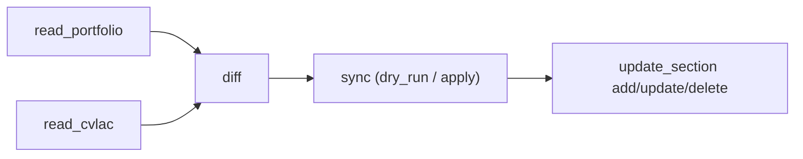

<p align="center">
  <picture>
    <source media="(prefers-color-scheme: dark)" srcset="https://raw.githubusercontent.com/stivenson/cvlac-mcp/master/assets/logo-dark.svg">
    
  </picture>
</p>

<h1 align="center">cvlac-mcp</h1>

[](https://www.npmjs.com/package/cvlac-mcp)
[](#instalación-rápida-npx--5-minutos)


**Actualiza tu hoja de vida de CvLAC (MinCiencias) desde el chat de tu editor, sin llenar formularios a mano.**

Servidor MCP (stdio) escrito en **TypeScript + Playwright**. Le dices qué agregar o corregir; él abre CvLAC
con tu cuenta, llena el formulario, lo guarda y verifica que quedó guardado. Los datos pueden salir de tu
portafolio web, de un JSON curado o de lo que le dictes en el chat.

Sirve para cualquier persona con hoja de vida en CvLAC. No trae datos de nadie: tus credenciales, tus valores
por defecto y tus proyectos curados viven en archivos locales que el repo ignora.

**Instalación en un comando:** no hay que clonar ni compilar — [empieza aquí](#instalación-rápida-npx--5-minutos).

Permite:
- leer datos en vivo del CvLAC (`read_cvlac`, `read_cvlac_detail`)
- leer el portafolio (`read_portfolio`)
- calcular diferencias (`diff`): faltantes, a actualizar, parecidos y al día
- aplicar cambios por sección (`update_section`: `add` / `update` / `delete`)
- sincronizar de forma masiva (`sync`, con `dry_run`)

Dos garantías al escribir: **nunca crea un duplicado sin preguntar** (si ya hay algo igual o parecido devuelve `needs_confirmation` en vez de escribir) y **siempre dice qué campo falló** cuando CvLAC rechaza un formulario.

> **Uso responsable.** Esto automatiza un sitio gubernamental con tu propia cuenta. Úsalo con supervisión
> humana, revisa cada `dry_run` antes de aplicar y no lo dejes corriendo sin mirar.
> Tus credenciales no salen de tu máquina: [Seguridad y privacidad](#seguridad-y-privacidad).

> **Proyecto independiente.** No está afiliado a MinCiencias ni respaldado por esa entidad. No
> reproduce su logotipo ni su identidad visual: el símbolo de arriba es original —unas llaves
> `{ }` de JSON-RPC dentro de un anillo de trazos que convergen— y las marcas «CvLAC», «ScienTI»
> y «MinCiencias» se nombran solo para identificar el sistema con el que habla el servidor.

Qué está verificado, qué falta y las limitaciones conocidas: **[ROADMAP.md](https://github.com/stivenson/cvlac-mcp/blob/master/ROADMAP.md)**.

---

## Tabla de contenido

- [Instalación rápida (npx) — 5 minutos](#instalación-rápida-npx--5-minutos) ← empieza aquí
- [Instalación desde el código fuente (clonar)](#instalación-desde-el-código-fuente-clonar) — para desarrollar o contribuir
  - [Registrar el MCP en tu editor](#paso-5---registrar-el-mcp-en-tu-editor) — Cursor · Claude Code · Claude Desktop · VS Code · Windsurf · Zed · JetBrains
- [Arquitectura](#arquitectura)
- [Tools MCP disponibles](#tools-mcp-disponibles)
- [Variables de entorno](#variables-de-entorno)
- [Uso local](#uso-local)
- [Flujo recomendado](#flujo-recomendado)
- [Pruebas y build](#pruebas-y-build)
- [Troubleshooting](#troubleshooting)
- [Seguridad y privacidad](#seguridad-y-privacidad) — [credenciales](#credenciales-y-privacidad) · [uso responsable](#uso-responsable-y-términos)
- [Estado y roadmap](#estado-y-roadmap)

---

## Instalación rápida (npx) — 5 minutos

La vía recomendada si solo quieres **usar** el servidor. No clonas ni compilas: `npx` descarga el paquete y lo
ejecuta. Si vas a modificar el código, salta a
[instalación desde el código fuente](#instalación-desde-el-código-fuente-clonar).

### 1. Node 20+ y el navegador

```bash
node --version                        # debe mostrar v20 o superior
npx -y cvlac-mcp@1 install-browser    # el navegador que maneja CvLAC (~150 MB, una sola vez)
```

El `@1` fija la versión mayor: recibes arreglos, pero no un cambio incompatible sin enterarte. Para
pasar a una versión mayor nueva, cambia ese número aquí y en la configuración del editor.

¿La descarga falla con `UNABLE_TO_VERIFY_LEAF_SIGNATURE` o `SELF_SIGNED_CERT_IN_CHAIN`? Un antivirus
(Avast, ESET, Kaspersky…) o la red de tu universidad está inspeccionando el tráfico con su propio
certificado. Dile a Node que confíe en los certificados de tu sistema (Node 22.15+ / 23.8+):

```powershell
$env:NODE_OPTIONS="--use-system-ca"; npx -y cvlac-mcp@1 install-browser   # Windows (PowerShell)
```

```bash
NODE_OPTIONS=--use-system-ca npx -y cvlac-mcp@1 install-browser           # Linux / macOS
```

Con un Node anterior, exporta el certificado raíz del antivirus o de la red y apunta a él con
`NODE_EXTRA_CA_CERTS=/ruta/al/certificado.pem`.

Usa el CLI de Playwright que trae este paquete, no el último publicado. Importa: cada build de
navegador pertenece a una versión de Playwright, y `npx playwright install` —que resuelve siempre a la
última— puede dejarte un Chromium que este servidor no sabe arrancar.

¿No tienes Node 20? [nvm](https://github.com/nvm-sh/nvm) (`nvm install 20`) en Linux/macOS,
`brew install node@20` con Homebrew, o `winget install OpenJS.NodeJS.LTS` en Windows.
En algunas distros de Linux hace falta además `npx playwright install-deps chromium`, que instala
librerías del sistema y no depende de la versión.

### 2. Guarda tus credenciales en un archivo aparte

Son las mismas con las que entras a CvLAC. Se quedan en tu máquina; ver
[Credenciales y privacidad](#credenciales-y-privacidad).

Cada valor va entre **comillas simples**: sin ellas, una clave con `#` se corta ahí, y con comillas
dobles la consola cambia lo que venga después de un `$`. `CVLAC_NOMBRE` es tu primer nombre tal como
lo registraste, con sus tildes.

**Linux / macOS:**

```bash
mkdir -p ~/.config/cvlac-mcp
cat > ~/.config/cvlac-mcp/.env <<'EOF'
CVLAC_NOMBRE='tu_primer_nombre'
CVLAC_CEDULA='tu_numero_de_cedula'
CVLAC_PASSWORD='tu_clave'
EOF
chmod 600 ~/.config/cvlac-mcp/.env
```

**Windows (PowerShell):**

```powershell
mkdir "$HOME\.config\cvlac-mcp" -Force
$contenido = @'
CVLAC_NOMBRE='tu_primer_nombre'
CVLAC_CEDULA='tu_numero_de_cedula'
CVLAC_PASSWORD='tu_clave'
'@
[IO.File]::WriteAllText("$HOME\.config\cvlac-mcp\.env", $contenido)
icacls "$HOME\.config\cvlac-mcp\.env" /inheritance:r /grant:r "${env:USERNAME}:(R,W)"
```

> `@'...'@` (comilla simple) no interpreta el `$` de una clave; `@"..."@` sí. `WriteAllText` escribe
> UTF-8 en las dos versiones de PowerShell, e `icacls` deja el archivo legible solo por tu usuario —
> el equivalente de `chmod 600`. Si prefieres el Bloc de notas (`notepad "$HOME\.config\cvlac-mcp\.env"`),
> también guarda en UTF-8.
>
> Si el archivo quedó en UTF-16 (`Out-File`, `>`) o en ANSI (`Set-Content`), el servidor lo detecta,
> lo lee igual y lo avisa en su log al arrancar.

No guardes este archivo en Escritorio ni en Documentos si esas carpetas se sincronizan con OneDrive o
Google Drive: `~/.config/cvlac-mcp/` no se sincroniza.

### 3. Registra el MCP en tu editor

**Linux / macOS:**

```json
{
  "mcpServers": {
    "cvlac-mcp": {
      "command": "npx",
      "args": ["-y", "cvlac-mcp@1"],
      "env": {
        "CVLAC_ENV_FILE": "/home/TU_USUARIO/.config/cvlac-mcp/.env"
      }
    }
  }
}
```

**Windows:** `npx` no es un ejecutable sino un script, así que va detrás de `cmd /c`. Las rutas llevan
las barras invertidas duplicadas, porque el archivo es JSON:

```json
{
  "mcpServers": {
    "cvlac-mcp": {
      "command": "cmd",
      "args": ["/c", "npx", "-y", "cvlac-mcp@1"],
      "env": {
        "CVLAC_ENV_FILE": "C:\\Users\\TU_USUARIO\\.config\\cvlac-mcp\\.env"
      }
    }
  }
}
```

Cambia `TU_USUARIO` por tu usuario: la ruta debe ser **absoluta**. `CVLAC_ENV_FILE` es obligatorio en
esta vía — instalado desde npm el servidor vive en la caché de `npx`, un directorio que tú no editas, así
que no encontraría el `.env` por su cuenta.

**Claude Code** lo registra con un comando. En Windows, la consola importa:

```bash
# Linux / macOS
claude mcp add cvlac-mcp --scope user -e CVLAC_ENV_FILE=$HOME/.config/cvlac-mcp/.env -- npx -y cvlac-mcp@1

# Windows, desde Git Bash: sin MSYS_NO_PATHCONV, Git Bash convierte "/c" en "C:/" y el servidor no conecta
MSYS_NO_PATHCONV=1 claude mcp add cvlac-mcp --scope user -e 'CVLAC_ENV_FILE=C:\Users\TU_USUARIO\.config\cvlac-mcp\.env' -- cmd /c npx -y cvlac-mcp@1
```

Desde **PowerShell**, el `--` no llega a `claude` y el comando falla con `unknown option '-y'`. Usa Git
Bash, pon `--%` antes de los argumentos, o pega el JSON de Windows de arriba con `claude mcp add-json`.

Dónde va ese JSON en cada editor (Cursor, Claude Code, Claude Desktop, VS Code, Windsurf, Zed, JetBrains):
[Paso 5](#paso-5---registrar-el-mcp-en-tu-editor).

### 4. Verifica

Reinicia el editor (Claude Desktop hay que cerrarlo del todo) y en el chat pide, en este orden:

1. `login` — debe autenticar y dejar la sesión guardada.
2. `read_cvlac` de la sección `formacion` — debe devolver lo que ya tienes en CvLAC.

Si ambas responden sin error, quedó listo. ¿Falla algo? → [Troubleshooting](#troubleshooting).

La primera vez `npx` descarga el paquete y el servidor puede tardar unos 15 segundos en arrancar. Si el
editor lo muestra desconectado, espera un momento y reinícialo: la segunda vez ya está en caché.

Para comprobar el paquete sin pasar por el editor: `npx -y cvlac-mcp@1 --version` imprime la versión y
`npx -y cvlac-mcp@1 --help` lista los comandos.

### Archivos opcionales

Nada de esto hace falta para arrancar. Cuando los quieras, apúntalos con variables en el mismo bloque `env`:

| Variable | Qué apunta | Para qué |
|---|---|---|
| `CVLAC_CONFIG_PATH` | Tu `cvlac.config.json` | Valores por defecto: institución, país, URL del portafolio ([Paso 4b](#paso-4b---configurar-tus-valores-por-defecto-cvlacconfigjson)) |
| `CVLAC_PORTFOLIO_EXTRA_PATH` | Tu `data/portfolio-extra.json` | Proyectos, software y eventos curados a mano ([Paso 4c](#paso-4c---curar-proyectos-software-y-eventos-dataportfolio-extrajson)) |

Sugerido: guárdalos junto al `.env`, en `~/.config/cvlac-mcp/`.

---

## Instalación desde el código fuente (clonar)

Para **desarrollar, contribuir o auditar** el código. Si solo quieres usar el servidor, la vía de arriba es
más corta. Sigue los pasos en orden; cada uno incluye una verificación para no avanzar con un entorno roto.

### Paso 0 - Prerrequisitos (todas las plataformas)

Necesitas **Node.js 20 o superior**, **npm 10+** y **git**.

| Plataforma | Cómo instalar Node 20+ |
|---|---|
| **Linux** (Debian/Ubuntu) | `curl -fsSL https://deb.nodesource.com/setup_20.x \| sudo -E bash - && sudo apt-get install -y nodejs git` |
| **Linux** (cualquier distro, recomendado) | Instalar [nvm](https://github.com/nvm-sh/nvm) y luego `nvm install 20 && nvm use 20` |
| **macOS** | `brew install node@20 git` (con [Homebrew](https://brew.sh)) o nvm |
| **Windows** | `winget install OpenJS.NodeJS.LTS` y `winget install Git.Git` (o instalador desde [nodejs.org](https://nodejs.org)) |

**Verifica** (sirve igual en bash, zsh o PowerShell):

```bash
node --version   # debe mostrar v20.x o superior
npm --version    # debe mostrar 10.x o superior
git --version
```

### Paso 1 - Clonar el repositorio

**Linux / macOS (bash o zsh):**

```bash
cd ~/dev            # o la carpeta que prefieras
git clone https://github.com/stivenson/cvlac-mcp.git
cd cvlac-mcp
```

**Windows (PowerShell):**

```powershell
cd $HOME\dev        # crea la carpeta antes si no existe: mkdir $HOME\dev
git clone https://github.com/stivenson/cvlac-mcp.git
cd cvlac-mcp
```

### Paso 2 - Instalar dependencias y compilar

Igual en las tres plataformas:

```bash
npm install
npm run build
```

**Verifica:** debe existir el archivo de entrada compilado `dist/index.js`.

```bash
# Linux / macOS
ls dist/index.js
```

```powershell
# Windows (PowerShell)
Test-Path dist\index.js   # debe imprimir True
```

### Paso 3 - Instalar el navegador de Playwright

El servidor automatiza CvLAC con Chromium headless. Descarga el build que corresponde a la versión de
Playwright del proyecto:

```bash
node dist/index.js install-browser
```

En **Linux**, si faltan librerías del sistema, instala también las dependencias nativas:

```bash
npx playwright install-deps chromium   # requiere sudo en algunas distros
```

### Paso 4 - Configurar variables de entorno (`.env`)

Copia la plantilla y edita los valores:

**Linux / macOS:**

```bash
cp .env.example .env
```

**Windows (PowerShell):**

```powershell
Copy-Item .env.example .env
```

Edita `.env` con tus datos:

```bash
CVLAC_NOMBRE='TuNombre'
CVLAC_CEDULA='TuDocumento'
CVLAC_PASSWORD='TuPassword'
PORTFOLIO_URL='https://tu-usuario.github.io'
# Opcional: por defecto, .cvlac-session.json en tu carpeta de usuario
# CVLAC_SESSION_PATH='/ruta/a/tu/.cvlac-session.json'
```

Restringe los permisos del archivo (Linux/macOS):

```bash
chmod 600 .env
```

En Windows, el equivalente de `chmod` es
`icacls .env /inheritance:r /grant:r "${env:USERNAME}:(R,W)"`.

`CVLAC_SESSION_PATH` por plataforma (ejemplos, si quieres cambiarlo):
- **Linux:** `/home/TU_USUARIO/.cvlac-session.json`
- **macOS:** `/Users/TU_USUARIO/.cvlac-session.json`
- **Windows:** `C:\\Users\\TU_USUARIO\\.cvlac-session.json`

### Paso 4b - Configurar tus valores por defecto (`cvlac.config.json`)

Varios formularios de CvLAC exigen campos que tu portafolio no tiene (municipio, intensidad horaria, idioma). Se declaran una vez aquí:

```bash
cp cvlac.config.example.json cvlac.config.json
```

```json
{
  "portfolioUrl": "https://tu-usuario.github.io",
  "defaults": {
    "municipio": { "nombre": "Bogotá", "codigoDane": "11001" },
    "institucionFallback": "Universidad Nacional de Colombia",
    "horasSemanales": 1,
    "idioma": "ES",
    "pais": "CO"
  }
}
```

Todo es opcional. **Si un valor falta, el campo se deja vacío y la respuesta trae un warning** — el servidor no inventa datos para tu hoja de vida.

### Paso 4c - Curar proyectos, software y eventos (`data/portfolio-extra.json`)

Estas tres secciones no se pueden leer del portafolio: necesitan metadatos que solo existen en CvLAC (tipo de proyecto, código DANE, códigos de enum). Se mantienen a mano:

```bash
cp data/portfolio-extra.example.json data/portfolio-extra.json
```

El archivo se valida al cargarse; si un ítem está mal formado, el servidor lo reporta y sigue con las demás secciones.

### Paso 5 - Registrar el MCP en tu editor

El servidor habla **MCP por stdio** y su entrypoint real es `dist/index.js`. Cualquier cliente
que soporte MCP sirve; sólo cambia dónde vive el archivo de configuración.

**El bloque base es el mismo en todos** (ajusta la ruta a tu sistema):

```json
{
  "command": "node",
  "args": ["/home/TU_USUARIO/dev/cvlac-mcp/dist/index.js"]
}
```

Ruta de `args` según el SO:
- **Linux:** `"/home/TU_USUARIO/dev/cvlac-mcp/dist/index.js"`
- **macOS:** `"/Users/TU_USUARIO/dev/cvlac-mcp/dist/index.js"`
- **Windows:** `"C:\\Users\\TU_USUARIO\\dev\\cvlac-mcp\\dist\\index.js"` (dobles barras invertidas en JSON)

> **Deja las credenciales solo en `.env`.** Clonado, el servidor lo carga desde su propio directorio, así
> que no hace falta repetirlas en la configuración del editor (instalado con `npx` es distinto: ahí sí
> hace falta `CVLAC_ENV_FILE`, ver [la instalación rápida](#3-registra-el-mcp-en-tu-editor)) — y esos archivos suelen estar en tu
> home sin permisos restringidos, o sincronizados entre máquinas. Si aun así las pones en un bloque
> `env`, ganan sobre `.env`.

#### Cursor

Archivo: `~/.cursor/mcp.json` (global) · `<proyecto>/.cursor/mcp.json` (por proyecto) ·
Windows: `%USERPROFILE%\.cursor\mcp.json`

```json
{
  "mcpServers": {
    "cvlac-mcp": {
      "command": "node",
      "args": ["/home/TU_USUARIO/dev/cvlac-mcp/dist/index.js"]
    }
  }
}
```

Reinicia Cursor y confirma en *Settings → MCP* que `cvlac-mcp` aparece activo y lista sus tools.

#### Claude Code (CLI)

Una línea, sin editar JSON a mano:

```bash
claude mcp add cvlac-mcp --scope user -- node /home/TU_USUARIO/dev/cvlac-mcp/dist/index.js
```

`--scope user` lo deja disponible en todos tus proyectos; `--scope project` lo escribe en
`.mcp.json` del repo actual (se versiona y lo comparte el equipo) y `--scope local` sólo para ti
en ese proyecto. Verifica con `claude mcp list` y, dentro de una sesión, con `/mcp`.

En **Windows** sin WSL, el comando es el mismo cambiando la ruta:

```powershell
claude mcp add cvlac-mcp --scope user -- node C:\Users\TU_USUARIO\dev\cvlac-mcp\dist\index.js
```

#### Claude Desktop

Archivo `claude_desktop_config.json`:
- **macOS:** `~/Library/Application Support/Claude/claude_desktop_config.json`
- **Windows:** `%APPDATA%\Claude\claude_desktop_config.json`
- **Linux:** `~/.config/Claude/claude_desktop_config.json`

Mismo formato que Cursor (`mcpServers`). Requiere **cerrar y reabrir** la app — no basta con
recargar la ventana.

#### VS Code (GitHub Copilot / modo agente)

Archivo: `<proyecto>/.vscode/mcp.json` (por workspace) o el `mcp.json` de usuario
(*Command Palette → MCP: Open User Configuration*). Ojo: la clave es **`servers`**, no `mcpServers`.

```json
{
  "servers": {
    "cvlac-mcp": {
      "type": "stdio",
      "command": "node",
      "args": ["/home/TU_USUARIO/dev/cvlac-mcp/dist/index.js"]
    }
  }
}
```

Las tools aparecen en el selector de herramientas del chat en modo agente.

#### Windsurf

Archivo: `~/.codeium/windsurf/mcp_config.json`. Formato `mcpServers`, igual que Cursor.

#### Zed

Archivo `settings.json` de Zed. Los servidores MCP van bajo **`context_servers`** y el binario
bajo `command`:

```json
{
  "context_servers": {
    "cvlac-mcp": {
      "source": "custom",
      "command": "node",
      "args": ["/home/TU_USUARIO/dev/cvlac-mcp/dist/index.js"]
    }
  }
}
```

#### JetBrains (IntelliJ, PyCharm, WebStorm…)

Con el plugin de AI Assistant / Junie: *Settings → Tools → AI Assistant → Model Context Protocol
(MCP) → Add*. Acepta pegar el mismo JSON de `mcpServers`, o llenar `command` = `node` y
`arguments` = la ruta a `dist/index.js`.

#### Otro cliente MCP

Cualquiera que acepte un servidor stdio funciona. Lo único que necesita saber:
ejecutable `node`, argumento la ruta absoluta a `dist/index.js`, sin argumentos extra ni puertos.

---

### Paso 5b - ¿No quieres clonar?

Existe la vía corta con `npx`, sin clonar ni compilar:
**[Instalación rápida (npx)](#instalación-rápida-npx--5-minutos)**.

### Paso 6 - Verificar la instalación

1. **Build y tests** en verde:

   ```bash
   npm run build
   npm test
   ```

2. **Arranque del servidor** (sanity check; queda esperando por stdio, ciérralo con `Ctrl+C`):

   ```bash
   node dist/index.js
   ```

3. **En tu editor:** reinícialo (Claude Desktop necesita cerrarse del todo) y confirma que
   `cvlac-mcp` aparece activo y lista sus tools — *Settings → MCP* en Cursor, `claude mcp list`
   o `/mcp` en Claude Code, el selector de herramientas del chat agente en VS Code.

4. **Prueba funcional mínima** desde el chat de tu editor, en este orden:
   - `login` (debe autenticar y persistir sesión)
   - `read_portfolio` (debe devolver datos del portafolio)
   - `diff` (debe reportar `missing` / `upToDate`)

Si los tres responden sin error, el MCP quedó correctamente instalado y configurado.

---

## Arquitectura

```text
src/
├── index.ts                  # Entry point: subcomandos, carga del .env, stdio transport
├── cli.ts                    # install-browser, --version, --help
├── env.ts                    # Ubicación y lectura del .env (UTF-8, UTF-16 o ANSI)
├── server.ts                 # Registro de tools MCP
├── types.ts                  # Tipos de portfolio/CvLAC/diff/update
├── schemas.ts                # Un schema zod por sección
├── config.ts                 # cvlac.config.json
├── logger.ts                 # Logs a stderr, con secretos ocultos
├── diff.ts                   # Motor de comparación (normalize + nameMatches)
├── browser/
│   ├── session.ts            # Login, sesión persistente, Playwright context
│   ├── navigation.ts         # URLs de listas y formularios CvLAC
│   ├── navigate.ts           # Toda navegación: ritmo, reintentos, cortes
│   ├── pacing.ts             # Espaciado de peticiones y backoff
│   ├── availability.ts       # Distingue "CvLAC caído" de un error propio
│   └── catalogue.ts          # Catálogos de CvLAC (municipios, instituciones)
├── tools/
│   ├── login.ts
│   ├── read-cvlac.ts
│   ├── read-cvlac-detail.ts  # Ficha completa de un ítem
│   ├── read-portfolio.ts
│   ├── diff.ts
│   ├── update-section.ts     # add/update/delete por sección
│   ├── write-verdict.ts      # ¿Se guardó? saved / rejected / unverified
│   ├── profile.ts            # Perfil y redes académicas
│   ├── areas.ts              # Áreas de actuación
│   ├── sync.ts
│   └── screenshot.ts
└── extractors/
    ├── portfolio.ts
    └── cvlac/
        formacion.ts experiencia.ts cursos.ts reconocimientos.ts
        proyectos.ts software.ts eventos.ts
```

---

## Tools MCP disponibles

- `login`: autentica en CvLAC y persiste sesión.
- `read_cvlac`: lee una sección o todas (`all`) desde CvLAC.
- `read_cvlac_detail`: abre la ficha completa de un ítem (por sección y etiqueta) y devuelve sus pares campo/valor. Las listas solo muestran dos o tres columnas; esta es la única forma de ver lo que realmente quedó guardado.
- `read_profile`: lee las tres cosas que CvLAC guarda como **un solo registro** en vez de una lista: el texto de perfil del investigador (`txt_desc_perfil`), la tabla de redes sociales académicas y las áreas de actuación. Ninguna sale en `read_cvlac`.
- `update_profile`: escribe el texto de perfil y/o las redes académicas. Las redes se **fusionan** sobre lo guardado: `ReRedSocialIdent/insert.do` reescribe la tabla completa con lo que reciba, así que la tool la lee primero y reenvía todo. `url:null` elimina una red, y eso exige `confirm_delete:true`. El texto de perfil **no se puede vaciar**: CvLAC lo marca `required` (máx. 3950 caracteres), así que solo se reemplaza.

  `areas` es la lista completa de áreas de actuación **en orden** —la primera es la principal—, por nombre o por código de CvLAC. Reemplaza lo guardado, así que dejar una fuera es borrarla y exige `confirm_delete:true`. Un nombre ambiguo vuelve en `choices` en vez de adivinarse. El catálogo tiene 267 áreas en tres niveles y viaja completo dentro de la página del popup, no una petición por nivel. Una red que CvLAC no lista va en `otro`, con su nombre en `label`.
- `read_portfolio`: **renderiza** el portafolio con Playwright y lee el DOM de su ruta `#/resume` (pestañas Experiencia, Educación y Cursos). Antes descargaba `assets/index-*.js` y sacaba los datos del bundle con regex; el sitio se reescribió como app React de rutas hash cuyo contenido es JSX, así que esos objetos dejaron de existir y todo volvía vacío **sin error**. Usa un navegador aparte: la sesión de CvLAC no debe llevar sus cookies a un sitio de terceros.

  Los logros salen de la sección "Logros Destacados" del dashboard (`#/`), buscada por su título: otras secciones usan la misma tarjeta. Las habilidades conservan los grupos del propio sitio ("Lenguajes", "Cloud & DevOps"…).

`diff` busca cada formación del portafolio **en formación académica y complementaria a la vez**, y propone la que falte para la sección que le toca (diplomados, cursos y talleres → complementaria). Un reconocimiento con otra redacción cuenta como `similar` si comparte una palabra del título del portafolio (el tipo de premio) y otra de su descripción (por qué fue): los títulos solos casi nunca coinciden.
- `diff`: compara CvLAC vs portafolio y reporta cuatro grupos: `missing`, `toUpdate`, `similar` (parecidos a algo existente) y `upToDate`.
- `update_section`: aplica cambio puntual (`add`, `update`, `delete`). Devuelve `status` (`ok`, `failed`, `needs_confirmation` o `unverified` — se envió pero CvLAC no dejó confirmarlo, típicamente porque se cayó a mitad), `warnings` por campo y, si detecta un posible duplicado, `needs_confirmation` con los candidatos. `confirm_duplicate:true` fuerza la creación. **Un combobox ambiguo tampoco escribe:** si el nombre de institución coincide con varias filas del catálogo de CvLAC, devuelve `needs_confirmation` con los candidatos en `choices` (`{id, label}`) y no escribe nada. Se resuelve repitiendo con `data.institucionId`. Un nombre con coincidencia exacta se resuelve solo, sin preguntar. **Un `delete` tampoco borra a la primera:** devuelve `needs_confirmation` y hay que repetirlo con `confirm_delete:true`. El CvLAC no tiene deshacer.
- `sync`: ejecuta diff + aplica `missing` y `toUpdate` (con `dry_run` opcional). Los `similar` nunca se aplican solos.
- `screenshot`: captura la página que le pases en `url`, o la última lista, ficha o formulario que abrió una tool, recargada tal como está ahora. Rechaza los enlaces de acción (borrar, guardar): en CvLAC abrir uno lo ejecuta.
- `inspect_form`: inspecciona campos reales (`input/select/textarea`) de una URL CvLAC.

Secciones soportadas:
`formacion`, `formacionComple`, `experiencia`, `cursos`, `reconocimientos`, `proyectos`, `software`, `eventos`, `idiomas`, `lineas`, `demasTrabajos`.

- **demasTrabajos** — `name`, `year`, `month`, `medio` (Papel, Internet u Otro), `finalidad`, y opcionalmente `idioma` y `ciudad` (por defecto, los de `cvlac.config.json`). El formulario trae Enero y Papel preseleccionados: si faltan `month` o `medio` se guardan esos, y lo avisa. No entra al diff.

- **formacionComple** — formación complementaria. Mismo formulario que `formacion` (es el mismo módulo con `isTrayectoria=FC`), con dos diferencias: el catálogo de niveles es otro (`Y` Otros, `8` Extensión, `F` Cursos de corta duración, `E` MBA) y pide `startMonth`. Se puede forzar el nivel con `nivel`; si no, se infiere del nombre. Tampoco entra al `diff`: los cursos del portafolio ya se mapean a `cursos`.

`idiomas` y `lineas` no entran al `diff`: el portafolio no lleva ni idiomas ni líneas de investigación, así que cada fila del CvLAC se leería como un sobrante inexplicable. Se gestionan con `update_section` directamente.

- **idiomas** — `language` (nombre en español o código ISO de 2 letras) y los cuatro niveles `read`/`write`/`speak`/`listen`, o un `level` que los fija todos. Valores: Deficiente, Aceptable, Bueno.
- **lineas** — `name`, `active` (por defecto `true`, y lo avisa) y `objective`.

Un `update` que no logre cambiar ningún campo del formulario **no se envía**: devuelve `failed` con los warnings. Salir del formulario es el redirect normal de un guardado, así que reenviar los valores almacenados se veía exactamente igual que guardar.

La suite e2e (`tests/e2e/live-crud.mjs`) acepta además `--sections=perfil`, que ejercita el CRUD de `read_profile`/`update_profile`: toma un snapshot, escribe en una fila de red que nadie use, la edita, la borra y restaura lo que había. Comprueba explícitamente que las redes preexistentes sobrevivan a la escritura — el `insert.do` de CvLAC reescribe la tabla entera.

Redes académicas aceptadas por `update_profile` (`network`):
`google_scholar`, `researchgate`, `ssr`, `ssrn`, `academia_edu`, `mendeley`, `linkedin`,
`repositorios_disciplinares`, `repositorios_institucionales`, `researcher_id`,
`scopus_author_id`, `orcid`, `otro`.

---

## Variables de entorno

Definidas en `.env` (ver [Paso 4](#paso-4---configurar-variables-de-entorno-env)), o en el bloque
`env` de la configuración de tu editor, que tiene prioridad sobre el archivo:

| Variable | Descripción |
|---|---|
| `CVLAC_NOMBRE` | Nombre con el que inicias sesión en CvLAC |
| `CVLAC_CEDULA` | Documento de identidad |
| `CVLAC_PASSWORD` | Contraseña de CvLAC |
| `CVLAC_SESSION_PATH` | Ruta donde se guarda `storageState` para reusar sesión. Por defecto, `.cvlac-session.json` en tu carpeta de usuario |
| `PORTFOLIO_URL` | Portafolio a comparar. También configurable como `portfolioUrl` en `cvlac.config.json` |

Opcionales:

| Variable | Descripción |
|---|---|
| `CVLAC_HEADLESS` | `false` abre el navegador para ver qué hace |
| `CVLAC_LOG_LEVEL` | `debug` \| `info` (default) \| `warn` \| `error` \| `silent`. Los logs van a stderr |
| `CVLAC_LOG_FILE` | Además de stderr, agrega cada línea a este archivo |
| `CVLAC_USER_AGENT` | Reemplaza el user-agent del navegador. Por defecto se usa el del Chromium real, que coincide con tu sistema |
| `CVLAC_ENV_FILE` | Ubicación alterna del propio `.env`. Imprescindible al instalar desde npm, donde el servidor corre desde la caché de `npx` |
| `CVLAC_CONFIG_PATH` | Ubicación alterna de `cvlac.config.json` |
| `CVLAC_PORTFOLIO_EXTRA_PATH` | Ubicación alterna de `portfolio-extra.json` |

### Ritmo de las peticiones

CvLAC empieza a responder 5xx cuando las peticiones llegan pegadas. El servidor espacía
cada navegación, reintenta con backoff y, si el sitio rechaza varias seguidas, deja de
insistir hasta que pase un enfriamiento. Los valores por defecto sirven para un sync
normal; súbelos si notas 503 seguidos:

| Variable | Default | Descripción |
|---|---|---|
| `CVLAC_MIN_REQUEST_GAP_MS` | `900` | Espera mínima entre dos peticiones |
| `CVLAC_REQUEST_JITTER_MS` | `700` | Aleatorio que se suma a esa espera, para no tener un ritmo de máquina |
| `CVLAC_NAV_TIMEOUT_MS` | `30000` | Cuánto esperar a que cargue una página |
| `CVLAC_NAV_MAX_ATTEMPTS` | `3` | Intentos por navegación (5xx o timeout). `1` desactiva reintentos |
| `CVLAC_BACKOFF_BASE_MS` | `2000` | Espera tras el primer fallo; se duplica en cada intento |
| `CVLAC_BACKOFF_CAP_MS` | `30000` | Techo de esa espera |
| `CVLAC_OUTAGE_THRESHOLD` | `3` | Navegaciones fallidas seguidas antes de cortar el tráfico |
| `CVLAC_OUTAGE_COOLDOWN_MS` | `120000` | Cuánto se queda quieto tras cortar |

---

## Uso local

### Modo desarrollo (sin compilar)

```bash
npm run dev
```

### Modo producción local (compilado)

```bash
npm run build
npm start
```

---

## Flujo recomendado

1. `login`
2. `sync` con `dry_run: true`
3. Revisar el reporte con una persona: faltantes, a actualizar, **parecidos** y al día
4. Resolver los parecidos uno a uno — `update` sobre el existente, o `add` con `confirm_duplicate:true`
5. Aplicar el resto: `sync` sin `dry_run`, o `update_section` por ítem revisando los `warnings`
6. Verificar con `read_cvlac` de las secciones tocadas, o `screenshot`

Si trabajas con Claude Code, la skill `cvlac-sync` del [workspace cliente](https://github.com/stivenson/cvlac-workspace) encapsula este flujo.

### Diagrama


```mermaid
flowchart LR
  portfolio["read_portfolio"] --> diffEngine
  cvlacRead["read_cvlac"] --> diffEngine["diff"]
  diffEngine --> syncTool["sync (dry_run / apply)"]
  syncTool --> updateSection["update_section add/update/delete"]
```

---

## Pruebas y build

```bash
npm test        # suite completa: sin red, sin credenciales, sin CvLAC
npm run build
```

Los tests cubren extractores (contra fixtures HTML anonimizados), el motor de diff, los schemas, la carga de configuración, la redacción de secretos en logs, el reporte de `sync`, el borde MCP y la lectura de fichas de detalle. Los fixtures llevan datos ficticios a propósito: si capturas HTML real para uno nuevo, anonimízalo antes de commitear.

### Suite en vivo (opcional, escribe en tu CvLAC real)

```bash
CVLAC_E2E=1 npm run test:e2e:live                      # las 7 secciones
CVLAC_E2E=1 npm run test:e2e:live -- --sections=cursos  # solo una
```

Recorre el CRUD completo por sección contra tu cuenta real: lista → `add` → lista → `read_cvlac_detail` → `add` repetido (debe devolver `needs_confirmation`) → `update` → detalle para comprobar el cambio → `delete` → lista final. Cada ítem que crea lleva el prefijo `ZZ PRUEBA MCP`, siempre intenta borrarlo y, si algo sobrevive, lo reporta al final para que lo borres a mano.

Es la única suite que toca datos reales, por eso exige `CVLAC_E2E=1` y no corre con `npm test`. Deja el reporte en `tests/e2e/report-<fecha>.json` (gitignored).

Comandos disponibles:

```bash
npm run dev
npm run test:watch
npm start
```

---

## Troubleshooting

### El MCP usa una versión vieja del código

- Asegúrate de ejecutar `npm run build` tras cambiar `src/`.
- El cliente MCP ejecuta `dist/index.js`, no `src/index.ts`.

### `cvlac-mcp` no aparece en Cursor

- Verifica la ruta absoluta en `args` del `mcp.json` (Paso 5) y que `dist/index.js` exista.
- En Windows, usa dobles barras invertidas (`\\`) en las rutas dentro del JSON.
- Reinicia/recarga Cursor tras editar `mcp.json`.

### Errores de Playwright al iniciar el navegador

- `UNABLE_TO_VERIFY_LEAF_SIGNATURE` al descargarlo: un antivirus o proxy intercepta el tráfico. Ver
  [el paso 1](#1-node-20-y-el-navegador) (`NODE_OPTIONS=--use-system-ca`).
- `Executable doesn't exist at ...` significa que falta el navegador, o que el instalado pertenece a
  otra versión de Playwright. Las dos se arreglan igual: `npx -y cvlac-mcp@1 install-browser`, que usa el
  CLI empaquetado y baja el build correcto. `npx playwright install chromium` resuelve a la última
  versión publicada y puede dejarte justo en este error.
- En Linux, si el navegador existe pero no arranca, faltan librerías del sistema:
  `npx playwright install-deps chromium`.
- Para ver el navegador y entender dónde se traba: `CVLAC_HEADLESS=false`.

### "Faltan credenciales" aunque las escribiste

Al arrancar, el servidor deja en su log (stderr) una línea como
`env file: C:\Users\...\.env (found, 3 vars)`. El error de `login` dice además qué variables faltan y
qué ruta leyó:

- `NOT FOUND` / "no existe": la ruta de `CVLAC_ENV_FILE` en la configuración del editor está mal.
- "no encontré ninguna variable": el archivo existe pero está vacío o mal escrito. Cada línea es
  `NOMBRE='valor'`.
- `read as utf16le` o `read as latin1`: el archivo no estaba en UTF-8. El servidor lo leyó igual, pero
  conviene reescribirlo como indica el [paso 2](#2-guarda-tus-credenciales-en-un-archivo-aparte).

### CvLAC rechazó el inicio de sesión

El servidor lo intenta **una sola vez** y no reintenta, para no bloquear tu cuenta. Revisa `CVLAC_NOMBRE`
(tu primer nombre, con tildes), `CVLAC_CEDULA` y `CVLAC_PASSWORD`, y prueba entrar a mano en la web de
CvLAC con esos mismos datos antes de volver a intentarlo.

### Redirección inesperada a login

- La sesión pudo expirar. Ejecuta `login` nuevamente.
- Verifica que `.env` (o el `env` del `mcp.json`) tenga credenciales correctas.

### Cambios no aplican en formularios

- Algunos campos de CvLAC son `readonly` y se setean por JS.
- Usa `inspect_form` y `screenshot` para validar nombres de campo reales.
- Revisa [`docs/cvlac-findings.md`](https://github.com/stivenson/cvlac-mcp/blob/master/docs/cvlac-findings.md) como fuente de verdad.

### Falsos faltantes en `diff`

- `nameMatches()` normaliza acentos y sufijos (ej. `(Platzi)`, ` - Aprobado ...`).
- `experiencia` está intencionalmente fuera del diff automático.

---

## Seguridad y privacidad

### Credenciales y privacidad

Este servidor pide las credenciales con las que entras a CvLAC. Qué pasa con ellas, en concreto:

- **No salen de tu máquina.** Viven en tu `.env` local. El proceso las lee al arrancar y las escribe
  únicamente en el formulario de login de `scienti.minciencias.gov.co`.
- **No hay servidor intermedio, ni cuenta, ni telemetría, ni analítica.** El MCP corre como proceso local
  y habla por stdio con tu editor. Las únicas conexiones de red que abre son a **CvLAC** y, si usas
  `read_portfolio`, a **la URL de portafolio que tú configuras**.
- **La sesión vale tanto como la clave.** Las cookies del login se cachean en texto plano en
  `CVLAC_SESSION_PATH` (por defecto `~/.cvlac-session.json`). Mientras la sesión siga vigente, quien copie
  ese archivo entra a tu CvLAC **y puede escribir en él** sin tu clave. El servidor lo crea legible solo
  por ti en Linux y macOS; en Windows hereda los permisos de tu carpeta de usuario (tú, administradores y
  SYSTEM). Para restringirlo a mano:
  `chmod 600 ~/.config/cvlac-mcp/.env ~/.cvlac-session.json` (Linux/macOS) o
  `icacls "$HOME\.cvlac-session.json" /inheritance:r /grant:r "${env:USERNAME}:(R,W)"` (Windows).
- **Ni el `.env` ni la sesión en carpetas sincronizadas.** En Windows, Escritorio y Documentos suelen ir a
  OneDrive; Google Drive y Dropbox hacen lo mismo con las suyas. Las rutas por defecto de esta guía no lo
  están.
- **Cerrar la sesión:** borra el archivo de sesión. El servidor volverá a iniciar sesión la próxima vez.
- **Los logs no muestran secretos.** Con `CVLAC_LOG_LEVEL=debug` y `CVLAC_LOG_FILE`, lo primero que se
  activa para depurar, los valores de claves como password, cédula, cookie o token salen como `***`.
- **Tu modelo de IA sí ve los datos.** No las credenciales —el servidor nunca las devuelve como
  resultado— pero sí lo que las tools leen de tu CvLAC y de tu portafolio, porque eso viaja al chat de tu
  editor. Si tu hoja de vida tiene datos sensibles, tenlo en cuenta al elegir el proveedor del modelo.
- **Los screenshots pueden tener datos personales.** La tool `screenshot` guarda la pantalla tal cual,
  sesión iniciada incluida. No los adjuntes a un issue sin revisarlos.
- **Nunca pongas las credenciales en el JSON del editor** ni en el repo. Usa `CVLAC_ENV_FILE` apuntando a
  un archivo fuera del proyecto. El `.gitignore` ya excluye `.env`, sesiones, screenshots y logs, pero esa
  red de seguridad solo cubre este repo.
- Si sospechas que se filtró algo, cambia la clave en CvLAC y borra el archivo de sesión.

### Uso responsable y términos

- Esto automatiza un sitio del Estado colombiano **con tu propia cuenta y tus propios datos**. No evade
  autenticación, no accede a hojas de vida ajenas y no expone ninguna API no pública: hace lo mismo que
  harías tú con el navegador, más rápido.
- **Revisa los términos de uso de ScienTI/MinCiencias** y las políticas de tu institución antes de usarlo.
  Este proyecto es independiente y no está avalado por MinCiencias.
- **Supervisión humana siempre.** Corre `sync` con `dry_run` primero, lee lo que va a escribir y solo
  entonces aplícalo. No lo dejes corriendo sin mirar ni lo agendes.
- El servidor espacia sus peticiones a propósito para no golpear el servidor de CvLAC
  ([Ritmo de las peticiones](#ritmo-de-las-peticiones)). No subas ese ritmo ni lo corras en paralelo
  sobre varias cuentas.
- **La responsabilidad de lo que quede en tu hoja de vida es tuya.** Es una declaración con efectos ante
  convocatorias y procesos de evaluación: verifica en CvLAC lo que el servidor haya escrito.
- Para probar escrituras reales, usa ítems dummy y bórralos después.

---

## Estado y roadmap

Las 11 secciones con datos, el perfil, las redes académicas y las áreas de actuación se leen y escriben
(`add`/`update`/`delete`), con CRUD verificado contra el CvLAC real. El diff y el bloqueo de duplicados
también.

Detalle completo, limitaciones conocidas y lo que sigue: **[ROADMAP.md](https://github.com/stivenson/cvlac-mcp/blob/master/ROADMAP.md)**.

Hallazgos de navegación en vivo (URLs, columnas de tabla, nombres de campos, comportamiento de la sesión): **[docs/cvlac-findings.md](https://github.com/stivenson/cvlac-mcp/blob/master/docs/cvlac-findings.md)**.

Para detalles operativos de desarrollo interno, ver [`CLAUDE.md`](https://github.com/stivenson/cvlac-mcp/blob/master/CLAUDE.md).
